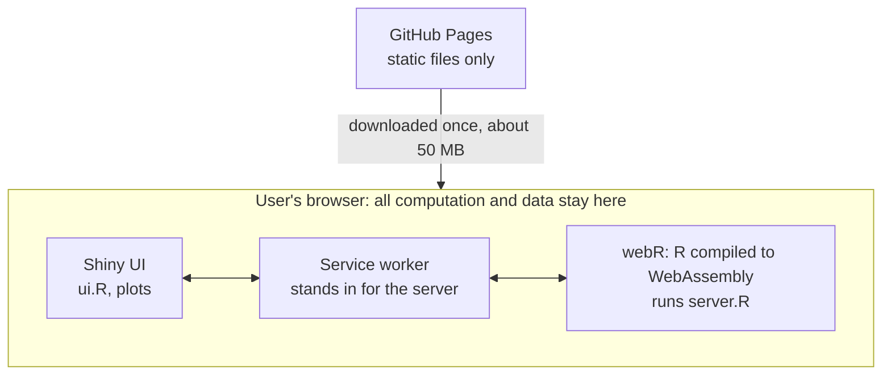

# webR Shiny Apps

R Shiny apps that run entirely in the web browser with [Shinylive](https://posit-dev.github.io/r-shinylive/) and [webR](https://docs.r-wasm.org/webr/latest/), hosted on GitHub Pages.
No server is involved, so data uploaded to an app never leave the user's computer.

<https://ksatohds.github.io/webR/>

| App | URL | Source |
|---|---|---|
| CART (classification and regression trees) | <https://ksatohds.github.io/webR/CART/> | `apps/CART/` |

## How it works

GitHub Pages does not run R; it only serves files. R itself runs in each user's browser.



1. On the first visit, the browser downloads webR (R compiled to WebAssembly, in `docs/shinylive/webr/`), the WebAssembly builds of the R packages the app uses, and the app itself (`docs/CART/app.json`, which holds `ui.R`, `server.R` and the font). Later visits use the browser cache.
2. webR starts in a background thread of the browser, loads the packages and runs the Shiny app.
3. A normal Shiny app is a web page talking to an R process on a server. Here a service worker intercepts the requests that would go to the server (page updates, file uploads, downloads) and passes them to webR in the same browser, so `ui.R` and `server.R` run almost unchanged.

| | Hosted Shiny server (e.g. shinyapps.io) | Shinylive / webR on GitHub Pages |
|---|---|---|
| Where R runs | On the server | In each user's browser |
| Uploaded data | Sent to the server | Stay on the user's computer |
| Main constraints | Server hours, idle sleep | First download, speed of the user's device |

The bundled webR holds only R, its base packages and the packages the apps need (about 83 MB on disk). Computation runs on the user's device and can be slower than a local R installation; webR is 32-bit, so it is not suited to very large data.

## Layout

| Path | Contents |
|---|---|
| `apps/<app>/` | App source (`ui.R`, `server.R` and any files bundled with the app) |
| `site/` | Files copied verbatim into `docs/` (the index page `index.html` and the example data) |
| `data-raw/` | Script that creates the example data, and bibliographic records of their sources |
| `tests/` | Script that creates test data for checking the apps |
| `build.R` | Exports all apps into `docs/` |
| `docs/` | The published site (GitHub Pages: branch `main`, folder `/docs`). **Do not edit by hand.** |

The webR runtime and the R packages under `docs/shinylive/` are shared by all apps.

## Build

Requires R and the CRAN package shinylive.

```bash
Rscript build.R          # all apps
Rscript build.R CART     # CART only
```

The packages an app uses are detected automatically, and their WebAssembly builds are bundled in `docs/shinylive/webr/packages/`.
If a locally installed package version differs from the WebAssembly build, a warning is shown, but the export still completes.

## Checking locally

`docs/` must be served over HTTP (it does not work from `file://`). To serve it under the same `/webR/` path as on GitHub Pages:

```bash
Rscript -e "httpuv::runServer('127.0.0.1', 7655, list(call = function(req) list(status = 404L, headers = list(), body = ''), staticPaths = list('/webR' = httpuv::staticPath('docs', indexhtml = TRUE))))"
```

Then open <http://localhost:7655/webR/CART/>.

After every rebuild, check that:

1. the browser console shows no errors while the packages are loaded;
2. a classification tree built from `tests/data/birthwt_jp.csv` (Japanese column names and factor levels; create it with `Rscript tests/make_testdata.R`) shows all six plots, including the ROC curve;
3. a regression tree can be built from `site/CART/data/iris.csv` (response `Sepal.Length`);
4. every download works (five PDFs, one PNG, and three CSV files encoded in CP932).

Known failure modes:

- Plots fail with `invalid 'width' argument`: the page was rendered with zero width (e.g. in a hidden tab). Reload it in a visible window.
- A package is not available for webR: the export warns about it. Check <https://repo.r-wasm.org/>.
- `system()` and other OS calls do not work in webR: branch on `R.version$os == "emscripten"`.

## Adding an app

1. Put `ui.R` and `server.R` (or `app.R`) in `apps/<Name>/`.
2. Run `Rscript build.R <Name>`.
3. Add the app to the list in `site/index.html` and run `Rscript build.R` again.
4. Check it locally, then commit and push.

## License

- Code written for this repository: MIT (see `LICENSE`).
- Example data, font and runtime (Shinylive, webR, R packages): see `THIRD-PARTY.md`.
